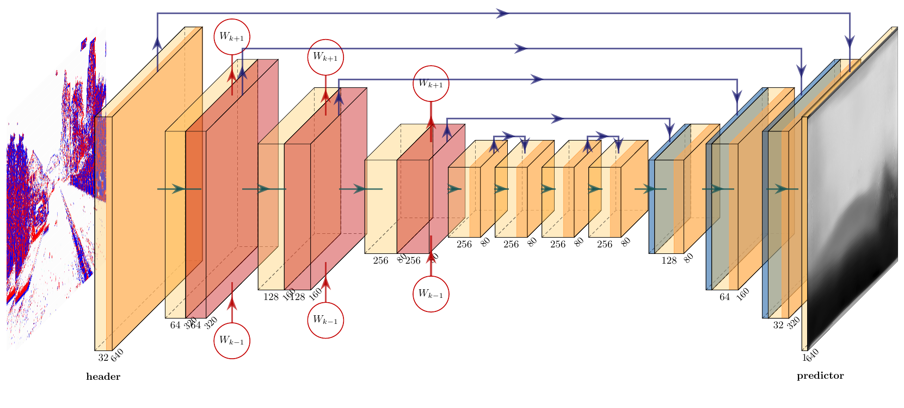

# A Reproduction of Learning Monocular Dense Depth from Events

[TOC]

---

## Introduction

The work is based on the paper **Learning Monocular Dense Depth from Events** [^7] as a reproduction project. Instead of using MVSEC dataset as in the original paper, we applied the model to a new dataset **DSEC**[^8]. 

As an extra experiment, we also tried different loss function using Structural similarity (SSIM) loss, which yields lower metric error. 

### Event Camera
An event camera, also known as a neuromorphic camera[^1], silicon retina[^2] or dynamic vision sensor[^3], is an imaging sensor that responds to local changes in brightness. Conventional cameras mainly use a shutter to capture images. However, event cameras mainly capture images with each pixels operating independently and asynchronously. It will only report changes of intensity at the pixel level.

Event cameras have a rather high dynamic range, mostly about 120dB[^4], which is about four times of the human eyes'. Event cameras are thus sensors that can provide high-quality visual information even in challenging high-speed scenarios and high dynamic range environments, enabling new application domains for vision-based algorithms. Recently, event cameras have received great interest in object recognition, autonomous vehicles, and robotics[^5].

 <b>Fig. 1</b> Event camera output verses standard camera output

### Depth Prediction
Depth prediction is the visual ability to perceive the world in three dimensions (3D) and the distance of an object. It has a rather important role in robotics and the automotive industry.

However, while event cameras have appealing properties, they also present unique challenges. Usually, the boundaries of the scene are not clearly prominent due to its working principle. Therefore, it needs to be filled in low contrast regions where no events are triggered, which makes the prediction much challenging.

Early works on event-based depth estimation used multi-view stereo and later Simultaneous Localization and Mapping (SLAM) to build a representation of the environment and therefore derivate metric depth. But these methods either rely on the expensive sensors or use the scale given by available camera poses. Purely vision-based approaches have investigated depth estimation using stereo event cameras, where they rely on maximizing temporal (as opposed to photometric) consistency between a pair of event camera streams to perform disparity and depth estimation.

In the work [^7], they mainly focus on dense, monocular, and metric depth estimation using an event camera, which addresses the aforementioned limitations. **This is the first paper that dense monocular depth is predicted using only events.**

## Event Representation

### Event Stream

The output of an ideal event camera is a stream of asynchronous events. A event $\mathbf{e}_i$ records its type $p_i \in \{ -1, 1\}$, triggered at moment $t_i$, when the brightness at pixel $(x_i, y_i)$ changes over $C$.  The event stream is an unordered list of events, sending asynchronously from the sensor.

### Spatio-Temporal Voxel Grid

Due to the sparse and asynchronous property of event stream, it's hard to feed into the neural network. Therefore, pre-processing event stream to other dense tensor-like representations while preserving its time information should be considered. In this paper, the authors use a novel representation named as spatio-temporal voxel grid. First, the input event stream is grouped into several fixed-size non-overlapping sliding windows based on their time $t_i$. The length of time window is $\Delta T$. Next, event within time window $j$ are grouped into $B$ temporal bins follows this rule:

$$ E _ { k } ( u _ { k } , t _ { n } ) = \sum _ { e _ { i } } p _ { i } \delta ( u _ { i } - u _ { k } ) \operatorname { max } \left( 0,1 - \left| t _ { n } - \frac { B - 1 } { \Delta T } ( t _ { i } - t _ { 0 } ) \right| \right) $$

Then the event stream can be converted to a $B \times H \times W$ tensor which could be feed into neural network. $H \times W$ are height and width of spatio-temporal voxel grid, $B$ can be regarded as channels.The non-zero values are then normalized as described in the paper.
In our reproduction we use $\Delta T = 50 ms$ and $B = 15$. 

## Network Architecture

 <b>Fig. 2</b> Network Structure

As shown in the figure above, the network we produced has a recurrent, fully convolutional structure. It can simply be divided as a header, an encoder, residual blocks, a decoder and a predictor.

This network structure draws on UNet, which has proven its potential on Frame-based Depth Estimation tasks. The skip connections between encoder and decoder make sure **features are learned for contracting the image can be used for reconstruction**. Therefore, it guarantees the performance for pixel-by-pixel prediction. Due to the flow mechanism of event data, the input voxel grid shares some information with other grids, therefore, LSTM is used to discover temporal features.

The header of this network is a 2D convolutional layer followed by Batch Normalization. The kernel size is set to be 5. The activation function is ReLU. It takes 15x640x480 event volumn as input.
The encoder consists of three similar layers with different channel size. Each layer has a 2D convolutional layer and a ConvLSTM layer, which has a LSTM structure with a convolultional gate. The kernel size of convolutional layer is 5, and that of ConvLSTM is selected to be 3.
After the encoder is 2 cascade residual layers with kernel size 3. In the residual layer there are 2 convolutional network with Batch Normalization. The activation function is ReLU. Summation is applied over the skip connection.
The decoder has three similar layers with different output channel size. Each layer consists of an upsampling convolution and a normal convolution with kernel size 5. 
Finally, the network use a predictor to output, which is a depth-wise convolution with kernel size 1. 
This network applies summation over all the skip connections. States from the ConvLSTM will be used for the next event volumn.

## Log Depth Map Output
The network is trained to output log depth maps 

$$
\hat{\mathcal{D}}_{k} \in[0,1]^{W \times H}
$$

which have the advantage of representing large depth variations in a compact range, facilitating learning. $k$ refers to the time step of the frame. The metric depth can be recovered by performing the following operations

$$
\hat{\mathcal{D}}_{m, k}=\mathcal{D}_{\max } \exp \left(-\alpha\left(1-\hat{\mathcal{D}}_{k}\right)\right)
$$

where $\mathcal{D}_{\max }$ is the maximum depth range of prediction. $α$ is a parameter chosen, such that a log depth value of 0 maps to minimum observed depth. We take $\mathcal{D}_{\max }=80 m$ and $\alpha = 3.7$, which results in a prediction range of $[2,80]$ meters. 

Therefore, the ground truth disparity is converted firstly to depth

$$
\mathcal{D}_m=\frac{T_{x} f}{-\left[d-\left(c_{x}-c_{x}^{\prime}\right)\right]}
$$

where $d$ is disparity, $T_x$ is the baseline between left and right cameras(here negative value), $f$ is focal length and $c_{x},c_{x}^{\prime}$ are the coordinates of left and right camera origins on the image (here $c_{x}-c_{x}^{\prime}=0$). After clipping and normalization, the ground truth depth is then converted to log depth

$$
\mathcal{D}_{log}=\frac{log(\frac{\mathcal{D}_m}{\mathcal{D}_{\max }})}{\alpha}+1
$$

Here we use $\mathcal{D}_{log}$ as label for each valid pixel. A pixel is valid if the depth is not infinity, or, equivalently, the disparity is non-zero. 

## Loss Function
The network is trained to minimize the scale-invariant loss $\mathcal{L}_{k, \text{si}}$ and multi-scale scale-invariant gradient matching loss $\mathcal{L}_{k, \text{grad}}$ at each time step $k$. 

$$
\mathcal{L}_{\text{tot}}=\sum_{k=0}^{L-1} \mathcal{L}_{k, \text{si}}+\lambda \mathcal{L}_{k, \text{grad}}
$$

where $\lambda$ is a hyper-parameter representing the loss weight. Given a sequence of ground truth log depth map $\{\mathcal{D}_{k }\}$ , denote the residual $R_k =\hat D_k − D_k$. Then the scale-invariant loss $\mathcal{L}_{k, \text{si}}$ is defined as

$$
\mathcal{L}_{k, \text{si}}=\frac{1}{n} \sum_{\mathbf{u}}\left(\mathcal{R}_{k}(\mathbf{u})\right)^{2}-\frac{1}{n^{2}}\left(\sum_{\mathbf{u}} \mathcal{R}_{k}(\mathbf{u})\right)^{2}
$$

where $n$ is the number of valid ground truth pixels $\mathbf{u}$. This loss function enforces the predicted log depth to be aligned with the ground truth,  irrespective of the absolute global scale [^6]. If the predicted metric depth $\mathcal{D}_m$ is multiplied by scale factor $\beta$ (offset by $\frac{\beta}{\alpha}$ for log depth $\mathcal{D}_{log}$), the loss would still be invariant. 

The multi-scale scale-invariant gradient matching loss $\mathcal{L}_{k, \text{grad}}$ encourages smooth depth changes and enforces sharp depth discontinuities in the depth map prediction.

$$
\mathcal{L}_{k, \operatorname{grad}}=\frac{1}{n} \sum_{s} \sum_{\mathbf{u}}\left|\nabla_{x} \mathcal{R}_{k}^{s}(\mathbf{u})\right|+\left|\nabla_{y} \mathcal{R}_{k}^{s}(\mathbf{u})\right|
$$

where $s$ refers to the different scale. Note that the scale $s$ here refers to the scale of image, not of the scale of depth. Different scale $s$ is obtained by sub-sampling by a factor of 2 on the input and ground truth.

We have chosen the same hyper-parameters as in the paper[^7]. There are totally 4 scales for $\mathcal{L}_{k, \text{grad}}$ (subsampling 4 times) and $λ$ = 0.5.

## Experiment

### Dataset

The training dataset is different from what reported in the paper. In the paper they trained their network on DENSE and MVSEC^[https://daniilidis-group.github.io/mvsec/]. DENSE data set is a synthetic dataset recorded from a simulation environment. 

Our training dataset only includes subfiles from DSEC dataset [^8], namely `zurich_city_00_b` and `interlaken_00_c`. DSEC offers data from a wide-baseline stereo setup of two color frame cameras and two high-resolution monochrome event cameras. In this project, we only use the data from the left event camera as training data and the disparity as ground truth.

A significant drawback of MVSEC for stereo algorithms is the small resolution of the DAVIS346 cameras **(346 x 260 pixels, 0.1 Megapixels)** and the small baseline of **10 centimeters** on top of that. On the other hand, DSEC dataset provides the resolution of **0.3 Megapixels (640×480)** and a larger baseline of **60 centimeters** on top of that. The depth error is approximately inversely proportional to the product of the baseline and focal length. Therefore, such improvements can provide us with more accurate data.

 <b>Fig. 3</b> Event data and image data from DSEC dataset

Due to the limitation on computational resources, we only use a batch size of 4. 

### Training Details

Same as in the paper, we train with a learning rate of $10^{-4}$ and use the Adam optimizer. We mainly use Google Colab as our platform. The GPU available is Tesla T4, with a memory of approximately 15 GB.

But because of the time limitation of Colab, the training process is not continous. We have to wait 12 hours for the Colab to be available. As shown in the following loss plots, the loss curves are not continous because of this problem.

 <b>Fig. 4</b>  Training loss

 <b>Fig. 5</b>  Validation loss

### Trying different loss function as an extra experiment

Besides the loss terms introduced previously, we also try adding SSIM loss as another term. SSIM is a perception-based model that considers image degradation as perceived change in structural information, while also incorporating important perceptual phenomena, including both luminance masking and contrast masking terms[^10].

The measure between two windows $x$ and $y$ of common size $N\times N$ is [^11]:
$$
\mathcal{SSIM}(x, y)=\frac{\left(2 \mu_{x} \mu_{y}+c_{1}\right)\left(2 \sigma_{x y}+c_{2}\right)}{\left(\mu_{x}^{2}+\mu_{y}^{2}+c_{1}\right)\left(\sigma_{x}^{2}+\sigma_{y}^{2}+c_{2}\right)}
$$
with:
- $\mu_{x}$ the average of $x$;
- $\mu_{y}$ the average of $y$;
- $\sigma_{x}^{2}$ the variance of $x$;
- $\sigma_{y}^{2}$ the variance of $y$;
- $\sigma_{x y}$ the covariance of $x$ and $y$;
- $c_{1}=0.01^2, c_{2}=0.03^2$ as hyper-parameters.

SSIM generally considers the similarity between 2 images and outputs the similarity index in range $[0,1]$. Higher value indicates higher similarity. SSIM loss function uses $1-\mathcal{SSIM}$, to make it descend. Previously, SSIM Loss has been applied in depth estimation on dense image data from frame-based camera, as in [^12]. 

Hence the loss function becomes

$$
\mathcal{L}_{\text{with\_ssim}}=\sum_{k=0}^{L-1} \mathcal{L}_{k, \text{si}}+\lambda_{grad} \mathcal{L}_{k, \text{grad}}+\lambda_{ssim} (1-\mathcal{SSIM}_k)
$$
where $\lambda_{ssim}$ is the SSIM loss weight, setted as 0.05.

SSIM loss term further promotes the similarity between predicted depth map and ground truth depth map. Similarly, we calculate this loss only on valid pixels by making invalid pixels value zero during loss calculation, in both ground truth label and prediction output. The SSIM loss implementation was built upon `pytorch_ssim`^[https://github.com/Po-Hsun-Su/pytorch-ssim].

## Results

### GitHub Repo

Due to the training code is missing in the official repository, we managed to build this neural network from scratch to reproduce the results the reported. Our repository can be found [here](https://github.com/edmundwsy/DSEC)

### Visualization
The results are visualizaed in inverse depth. Higher intensity denotes lower depth (closer distance).

 <b>Fig. 6</b> Predicted inverse depth

 <b>Fig. 7</b> Ground truth inverse depth

### Metrics

*Lower value indicates better result for all metrics.*

|   Metric    | Total Mean absolute error(MAE) | Total Mean square error(MSE) |
|:-----------:|:------------------------------:|:----------------------------:|
| Performance |             16.84              |            380.07            |

| Model types |   Event based   | Event based |  Frame based  |
|:-----------:|:---------------:|:-----------:|:-------------:|
|   Metrics   | Paper model[^7] |  Our model  | MonoDepth[^9] |
| MAE in 10m  |    **1.85**     |    5.32     |     3.44      |
| MAE in 20m  |    **2.64**     |    8.94     |     7.02      |
| MAE in 30m  |    **3.13**     |    12.04    |     10.03     |

In the paper, they trained **300 epoches (127800 iterations)** on the real world dataset consist of **8523 samples**. Due to limited computation resources, we trained **50 epoches** on a smaller dataset with **225 samples** only. Each sample is a 50ms time window consist of 5,000 to 500,000 events. Though produced reasonable results, our model still underperforms the baseline models.

### Results with SSIM Loss

We trained the model again with SSIM loss term. After only 7 epochs, we already observe lower metric errors. For comparison, we also overlay the orignal training metric curves without SSIM loss. The metric plots for the first 7 epochs are shown as follow. As you can see, the model with SSIM loss (dark blue) performs better than original model (light blue), which Mean Average Error for all stages decreases more slowly. 

 <b>Fig. 8</b> MAE in 10m 

 <b>Fig. 9</b> MAE in 20m 

 <b>Fig. 10</b> MAE in 30m 

 <b>Fig. 11</b> Total MAE 

 <b>Fig. 12</b> Total MSE 

With SSIM loss term, the metric errors descend to low values after training for only 7 epochs.

|             Model            |    MAE    |    MSE     | MAE in 10m | MAE in 20m | MAE in 30m |
|:------------------------------:|:---------:|:----------:|:----------:|:----------:|:----------:|
| Model trained with SSIM loss | **13.84** | **339.28** |  **3.22**  |  **4.83**  |  **7.85**  |
| Original model |   20.43   |   616.21   |    5.08    |    9.09    |   13.43    |

Due to time limit, we did not train the model with SSIM loss again for 50 epochs. But the model metrics are already better than the previous results. This implies the SSIM loss could not only be used for training on image data from frame-based camera, but also be applied to event data. 

## Discussion

1. Suffering from limited computational resources, the network is trained on relatively small amount of data. The total number of images in the training set is 900 (225 batch samples). This is one of the main reason why our model underforms their original model.
2. One way to boost the training process is to convert all the ground truth disparity data to log depth data in advance, and store it locally. Instead of converting the disparity data during training and validation, using the pre-computed log depth data directly can save computations.
3. Although our model use **sparse** event streams as input data, the **sparse** depth images as the ground truth, by carefully selecting losses, we finally obtain **dense** depth estimations.
5. The original paper uses synthetic data from simulation and performs data augumenation by random cropping and horizontal flip of the training samples. This could also be one the reason why our model underperforms theirs, since we only use real events from the dataset.
6. The model captures the large scale features (e.g. depth on ground and buildings) very well. But the small scale features are not well captured yet. As shown in the following picture, the pedestrain's outline is not clear. This could be one of the main sources of error. 

 <b>Fig. 9</b> Samll features are not well captured

6. We did not train enough with SSIM loss due to time limit. This could be a problem as we do not know the final performance of the model after sufficient training. Thus, from the metrics for the first 7 epochs, we could only suggest SSIM loss could potentially be useful in training depth estimation model on event data.

<!-- 5. The input of our model is event streams, we use sparse depth image as ground truth, by carefully selecting losses, we finally obtain dense depth estimations. -->

## Conclusion

We have successfully reproduce the paper **Learning Monocular Dense Depth from Events**, enabling depth prediction using monocular event camera data. Instead of using the MVSEC dataset, we applied the model to another dataset, namely **DSEC** dataset. 

Though not as good as shown in the paper, the model still achieves fairly good result in the evaluation. We also fill the blank of training code which is not given in the original code website. 

Finally, we tried adding SSIM loss term in training, which yields lower metric errors. Thus, SSIM loss could potentially be a useful loss term to boost training and to improve performance. 

## Reference
[^1]:Li, Hongmin; Liu, Hanchao; Ji, Xiangyang; Li, Guoqi; Shi, Luping (2017). "CIFAR10-DVS: An Event-Stream Dataset for Object Classification". Frontiers in Neuroscience. 11: 309. doi:10.3389/fnins.2017.00309.

[^2]: Sarmadi, Hamid; Muñoz-Salinas, Rafael; Olivares-Mendez, Miguel A.; Medina-Carnicer, Rafael (2021). "Detection of Binary Square Fiducial Markers Using an Event Camera". IEEE Access. 9: 27813–27826. arXiv:2012.06516. doi:10.1109/ACCESS.2021.3058423

[^3]: Liu, Min; Delbruck, Tobi (May 2017). "Block-matching optical flow for dynamic vision sensors: Algorithm and FPGA implementation". 2017 IEEE International Symposium on Circuits and Systems (ISCAS). pp. 1–4. arXiv:1706.05415. doi:10.1109/ISCAS.2017.8050295.

[^4]:Longinotti, Luca. "Product Specifications". iniVation. Retrieved 2019-04-22.

[^5]:Hambling, David. "AI vision could be improved with sensors that mimic human eyes". New Scientist. Retrieved 2021-10-28.

[^6]:Eigen, D., Puhrsch, C., and Fergus, R., “Depth Map Prediction from a Single Image using a Multi-Scale Deep Network”, <i>arXiv e-prints</i>, 2014.

[^7]: J. Hidalgo-Carrió, D. Gehrig and D. Scaramuzza, "Learning Monocular Dense Depth from Events," 2020 International Conference on 3D Vision (3DV), 2020, pp. 534-542, doi: 10.1109/3DV50981.2020.00063.

[^8]: Gehrig, M., Aarents, W., Gehrig, D., and Scaramuzza, D., “DSEC: A Stereo Event Camera Dataset for Driving Scenarios”, <i>arXiv e-prints</i>, 2021.

[^9]: Godard, C., Mac Aodha, O., and Brostow, G. J., “Unsupervised Monocular Depth Estimation with Left-Right Consistency”, <i>arXiv e-prints</i>, 2016.

[^10]: Wikipedia contributors. "Structural similarity." Wikipedia, The Free Encyclopedia. Wikipedia, The Free Encyclopedia, 8 May. 2022. Web. 15 Jun. 2022.

[^11]: Z. Wang, E. P. Simoncelli and A. C. Bovik, "Multiscale structural similarity for image quality assessment," The Thrity-Seventh Asilomar Conference on Signals, Systems & Computers, 2003, 2003, pp. 1398-1402 Vol.2, doi: 10.1109/ACSSC.2003.1292216.

[^12]: Sagar, A., “Monocular Depth Estimation Using Multi Scale Neural Network And Feature Fusion”, <i>arXiv e-prints</i>, 2020.
